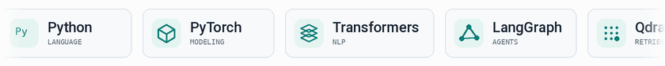

# Muhammad Ali Nasir

**ML & AI Systems Engineer** · Applied research · Open source

I build retrieval pipelines, language-model infrastructure, and tools for working with code and scientific literature. My work spans model training, fine-tuning, and the services that put models to use.

I’m interested in systems people can inspect: where an answer came from, how a model was evaluated, and what happens when an agent makes a mistake.

### Working stack

<picture>
  <source media="(prefers-color-scheme: dark)"
          srcset="./assets/skills-dark.gif" />
  
</picture>
**Models** : PyTorch · Transformers · scikit-learn · PEFT / LoRA  
**Retrieval & agents** : LangGraph · LangChain · CrewAI · Qdrant · Neo4j  
**Services** : Python · FastAPI · Docker · PostgreSQL · llama.cpp

Research interests: efficient NLP, agent evaluation, and time-series forecasting.

[Portfolio ↗](https://alinasir.me) &nbsp; · &nbsp; [LinkedIn](https://linkedin.com/in/al1-nasir) &nbsp; · &nbsp; [Kaggle](https://www.kaggle.com/al1nasir) &nbsp; · &nbsp; [Email](mailto:muhammadalinasir00786@gmail.com)
